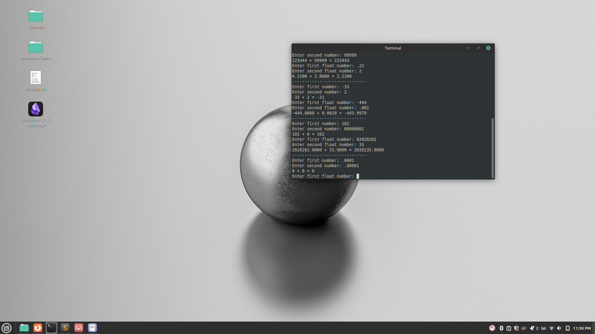

# Qemu Calculator

This project implements a simple calculator that can perform addition on both integers and floating-point numbers. The calculator runs on a custom OS environment and interacts with the user via a UART interface.



## Project Structure

-   `user/main.c`: The main application logic, which prompts the user for numbers, performs calculations, and prints the results.
-   `os/`: Contains the basic operating system functionalities, including UART communication (`os.c`, `os.h`) and the assembly root file (`root.s`).
-   `lib/`: Provides standard library functions for I/O (`stdio.c`, `stdio.h`) and string manipulation (`string.c`, `string.h`).
-   `Files/`: Contains the compiled binary (`calculadora.bin`), ELF file (`calculadora.elf`), object files, and the linker script.

## Building and Running

The project can be built and run using the `build_and_run.sh` script located in the `Files/` directory.

```bash
./Files/build_and_run.sh
```

This script compiles the source files, links them, and runs the resulting binary in a QEMU environment.

## `lib/stdio.c` Documentation

The `lib/stdio.c` file provides custom implementations of standard input/output functions. These functions are designed to work with the underlying UART interface provided by the OS.

### `PRINT(const char *f, ...)`

This function is a simplified version of `printf`. It can format and print strings, integers (`%d`), and floating-point numbers (`%f`).

**Parameters:**

-   `f`: A format string that can contain text and format specifiers.
-   `...`: A variable number of arguments corresponding to the format specifiers in the format string.

**Example:**

```c
PRINT("The sum of %d and %f is %f\n", 10, 3.14, 13.14);
```

### `READ(const char *f, ...)`

This function is a simplified version of `scanf`. It can read and parse integers (`%d`) and floating-point numbers (`%f`) from the UART input.

**Parameters:**

-   `f`: A format string that specifies the type of data to read.
-   `...`: A variable number of pointer arguments where the read data will be stored.

**Example:**

```c
int my_int;
float my_float;
READ("%d", &my_int);
READ("%f", &my_float);
```

### Static Helper Functions

#### `ftos(float value)`: Float to String Conversion

This function converts a floating-point number to its string representation for printing. While a float is internally represented by a sign, an exponent, and a mantissa (according to the IEEE 754 standard), this conversion algorithm operates on its decimal representation.

The logic is as follows:
1.  **Sign Handling**: It first checks if the number is negative. If it is, the sign is stored, and the absolute value of the number is used for the conversion. The sign is printed at the beginning.
2.  **Integer Part**: The integer part of the number is extracted by casting the float to an integer. This integer part is then converted to a string and printed.
3.  **Decimal Part**: The decimal part is obtained by subtracting the integer part from the original number. To print the decimal digits, this fractional part is multiplied by 10 repeatedly (for a fixed number of decimal places). In each step, the integer part of the result gives the next digit to print.

#### `stof(const char *s)`: String to Float Conversion

This function parses a string and converts it into a floating-point number.

The algorithm follows these steps:
1.  **Sign**: It checks for a leading `'-'` character to determine if the number is negative.
2.  **Integer Part**: It reads the sequence of digits before the decimal point and builds the integer part of the number.
3.  **Decimal Part**: If a `'.'` is found, it starts processing the fractional part. It reads each digit after the decimal point and adds it to the total, scaled by its corresponding power of 10 (0.1, 0.01, etc.).
4.  **Final Value**: The final float is constructed by adding the integer and decimal parts and applying the sign.
